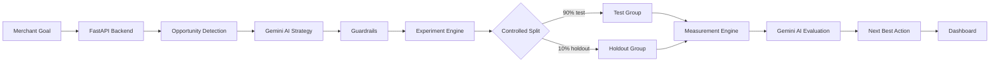

# GrowthPilot AI

An autonomous commerce growth engine that turns merchant opportunities into safe, measurable next-best actions.

## Problem

Commerce teams have many possible growth levers, but deciding which opportunity to pursue, how to test it safely, and what to do with the result is often manual and disconnected. Merchants need growth decisions that respect revenue, discount, budget, and margin constraints.

## Solution

GrowthPilot AI combines opportunity detection, Gemini-powered strategy decisions, merchant guardrails, controlled experiments, deterministic measurement, and AI result evaluation in one dashboard. It helps a merchant move from a detected opportunity to a measurable next action without losing control of business constraints.

## How GrowthPilot AI Works

1. **Opportunity Detection** identifies actionable commerce opportunities and their potential revenue.
2. **AI Decision** evaluates each opportunity and recommends an action, risk level, and decision.
3. **Guardrails** enforce merchant limits such as maximum discount and minimum margin.
4. **90/10 Controlled Experiment** sends 90% to the test group and 10% to the holdout group.
5. **Measurement** reports opportunity-specific revenue, growth, conversion lift, and margin change.
6. **AI Result Evaluation** classifies the outcome as `CONTINUE`, `OPTIMIZE`, or `STOP`.
7. **Next Best Action** is shown in the dashboard as the recommended follow-up.

## Key Features

- AI-powered opportunity strategy decisions
- Merchant growth goals and constraints
- Discount and margin guardrails
- Controlled 90/10 test vs holdout experiments
- Opportunity-specific measurement
- AI result evaluation with `CONTINUE` / `OPTIMIZE` / `STOP`
- Autopilot dashboard for continuously running the growth loop

## Example Results

| Opportunity | Incremental Revenue | Growth | Conversion Lift | Margin Change | Evaluation |
| --- | ---: | ---: | ---: | ---: | --- |
| Recover Abandoned Carts | ₹15,000 | +15% | +0.5% | -1% | `CONTINUE` |
| Increase Repeat Purchases | ₹8,000 | +8% | +0.3% | -0.5% | `OPTIMIZE` |
| Increase Average Order Value | ₹4,500 | +4% | +0.1% | 0% | `OPTIMIZE` |

## Architecture



## Tech Stack

| Layer | Technology |
| --- | --- |
| Frontend | Next.js, React, TypeScript, Tailwind CSS |
| Backend | FastAPI, Python |
| Persistence | SQLite, SQLAlchemy |
| AI | Gemini API through the OpenAI-compatible client |

## Project Structure

```text
growthpilot-ai/
├── backend/
│   ├── main.py          # FastAPI app, models, growth flow, and API endpoints
│   └── growthpilot.db   # SQLite database created by the backend
└── frontend/
    ├── app/
    │   ├── page.tsx     # GrowthPilot AI dashboard and flow UI
    │   ├── layout.tsx
    │   └── globals.css
    └── package.json
```

## Local Setup

Set `GEMINI_API_KEY` in the backend environment before starting the services.

### Backend

```bash
cd backend
python -m uvicorn main:app --reload
```

Backend URLs:

- API: http://127.0.0.1:8000
- Interactive API docs: http://127.0.0.1:8000/docs

### Frontend

```bash
cd frontend
npm install
npm run dev
```

Frontend URL:

- Dashboard: http://localhost:3000

## Demo Flow

1. Open the dashboard and review the current growth goal and constraints.
2. Let the dashboard load the highest-impact opportunities.
3. Run the AI decision for an opportunity, or use Autopilot to start the loop automatically.
4. Review the AI decision and guardrail outcome.
5. For an approved opportunity, review the launched 90/10 experiment.
6. Inspect opportunity-specific measurement results.
7. Review the AI result evaluation and its next best action.

## Safety & Guardrails

- Experiments are launched only when the AI strategy returns `APPROVE`.
- Maximum discount is checked against the merchant's configured limit.
- Minimum margin is checked before a strategy is approved.
- Result evaluation stops an experiment when the measured margin is below the merchant minimum.
- Experiments use a 90% test / 10% holdout split so results can be compared against a control group.

## Buildathon Demo Notes

- The dashboard presents the full autonomous loop in a single operator view.
- The example opportunities produce deterministic measurement results, making the demo repeatable.
- The strongest demo path is **Recover Abandoned Carts**, which produces `+15%` growth and a `CONTINUE` evaluation.
- Use the growth goal controls to demonstrate how merchant constraints remain part of every decision.
