# GrowthPilot AI

An autonomous commerce growth engine that turns merchant opportunities into safe, measurable next-best actions.

## Problem

Commerce teams have many possible growth levers, but deciding which opportunity to pursue, how to test it safely, and what to do with the result is often manual and disconnected. Merchants need growth decisions that respect revenue, discount, budget, and margin constraints.

## Solution

GrowthPilot AI combines opportunity detection, Gemini-powered strategy decisions, merchant guardrails, controlled experiments, deterministic measurement, and AI result evaluation in one dashboard. It helps a merchant move from a detected opportunity to a measurable next action without losing control of business constraints.

The current Opportunity Engine V1 analyzes deterministic local commerce records. Its data source can be replaced with a real payment or commerce integration later without changing the detection and scoring service.

## How GrowthPilot AI Works

1. **Opportunity Detection** identifies actionable commerce opportunities and their potential revenue.
2. **AI Decision** evaluates each opportunity and recommends an action, risk level, and decision.
3. **Guardrails** enforce merchant limits such as maximum discount and minimum margin.
4. **90/10 Controlled Experiment** assigns approximately 90% to `CONTROL` and 10% to `TREATMENT`.
5. **Measurement** reports opportunity-specific revenue, growth, conversion lift, and margin change.
6. **AI Result Evaluation** classifies the outcome as `CONTINUE`, `OPTIMIZE`, or `STOP`.
7. **Learning Memory** stores valid outcomes from finalized experiments for the same opportunity.
8. **Next Best Action** uses the current strategy and relevant learning to provide a recommendation; it does not execute campaigns.

The Opportunity Engine derives abandoned-cart recovery, repeat-purchase, average-order-value, failed-payment, and high-value-customer reactivation opportunities from customer, order, cart-event, and payment records. Estimates use explicit recovery-rate assumptions and a ₹4,000 demo AOV benchmark. Ranking is deterministic: revenue contributes up to 50 points when potential reaches ₹50,000; affected customers and orders each contribute up to 25 points at 30 records; then a risk penalty is subtracted. Risk is `LOW` for 20+ affected customers/orders, `MEDIUM` for 8–19, and `HIGH` below 8; corresponding penalties are 0, 10, and 20 points. Scores map to `HIGH` (70+), `MEDIUM` (40–69.99), and `LOW` (<40).

## Key Features

- AI-powered opportunity strategy decisions
- Data-driven opportunities with evidence, affected-customer counts, and transparent scores
- Idempotent local commerce demo-data seeding
- Merchant growth goals and constraints
- Discount and margin guardrails
- Controlled 90/10 test vs holdout experiments
- Persistent experiments with deterministic customer assignments
- Measurement from observed post-start orders, conversions, revenue, and recorded margin
- AI result evaluation with `CONTINUE` / `OPTIMIZE` / `STOP`
- Persistent, opportunity-specific learning from finalized experiment outcomes
- Learning-aware strategy prompts and evidence-based confidence coverage
- Recommendation-only Autopilot next actions
- Autopilot dashboard for the growth loop, learning memory, and next actions

## Example Results

Experiment outcomes are calculated from completed orders recorded for assigned customers after an experiment starts. Results are not pre-filled: if either variant has fewer than 10 assigned customers, the API reports `insufficient_sample`; before seven days, it reports `insufficient_observation_window`. The evaluator recommends collecting more data and does not finalize learning.

## Persistent Experiment Engine

- An approved opportunity creates a SQLite-backed `RUNNING` experiment with a unique public ID, hypothesis, control/treatment definitions, budget, and merchant guardrail settings.
- Eligible customers are selected from the existing commerce records for the opportunity type. At least 10 eligible customers are required; a stable SHA-256 ordering assigns approximately 90% to `CONTROL` and 10% to `TREATMENT`. Assignments are stored with a unique experiment/customer constraint and reused on duplicate requests.
- Experiments can be read with `GET /api/experiment/{experiment_id}` and paused, completed, or stopped with the corresponding `POST /api/experiment/{experiment_id}/pause`, `/complete`, and `/stop` routes.
- Measurement compares completed, validly paid orders (or completed orders without a separate payment record), converted customers, revenue, average order value, and recorded order margin across assigned groups. Orders before experiment start and orders from unassigned customers are excluded. Relative lift is unavailable when its baseline is zero. Evaluation requires at least 10 assigned customers per variant and a 7-day observation window.
- Evaluations use persisted experiment metrics, apply the recorded merchant minimum-margin guardrail before Gemini, and persist the decision, reason, next action, and metric snapshot. Underpowered evaluations do not call Gemini.
- The current commerce source and its seeded records are local synthetic/demo data. A future Razorpay integration can replace that source without changing the strategy and experiment flow.

## Autonomous Learning Loop

- A learning record is created only when a persistent experiment has sufficient observed sample, a valid final evaluation, and a finalized `COMPLETED` or `STOPPED` state. Insufficient-sample outcomes, paused experiments, and unavailable AI evaluations are not treated as learnings.
- Each record is unique per experiment and stores its opportunity, hypothesis, evaluation, next action, signal (`POSITIVE`, `OPTIMIZE`, or `NEGATIVE`), observed metric snapshot, and evidence confidence. Repeated evaluation requests return the existing record instead of duplicating it.
- Confidence is an explicitly defined evidence-coverage score: the smaller assigned group’s coverage up to 30 customers multiplied by the observation-window coverage up to 14 days. It is not a statistical significance probability.
- `GET /api/learning` returns recent learning records; `GET /api/learning/{opportunity}` returns records only for that URL-encoded opportunity. `/api/strategy` includes only history matching the current opportunity, after its existing discount and margin checks.
- `POST /api/autopilot/next-action` returns a learning-aware recommendation and history summary. It never creates an experiment, launches a campaign, or sends a message. Experiment creation remains on the existing approved-strategy flow.
- `GET /api/customers` lists persisted customer IDs. `POST /api/orders` records a locally observed order for an existing customer and optionally its payment event; repeated submissions with the same external order ID are idempotent.

## Architecture

```mermaid
flowchart LR
    A[Merchant Goal] --> B[FastAPI Backend]
    B --> C[Commerce Data]
    C --> D[Opportunity Engine]
    D --> E[Gemini AI Strategy]
    E --> F[Merchant Guardrails]
    F --> G[(Persistent Experiment)]
    G --> H[Deterministic Customer Assignments]
    H --> I{90/10 Split}
    I -->|90%| J[Control]
    I -->|10%| K[Treatment]
    J --> L[Observed Commerce Outcomes]
    K --> L
    L --> M[Measurement Engine]
    M --> N[Hard Margin Guardrail]
    N --> O[Gemini AI Evaluation]
    O --> P[(Persisted Evaluation)]
    P --> Q[(Opportunity-Scoped Learning Memory)]
    Q --> R[Next Best Action Recommendation]
    R --> S[Dashboard]
```



## Tech Stack

| Layer | Technology |
| --- | --- |
| Frontend | Next.js, React, TypeScript, Tailwind CSS |
| Backend | FastAPI, Python |
| Persistence | SQLite, SQLAlchemy |
| AI | Gemini API through the OpenAI-compatible client |

## Project Structure

```text
growthpilot-ai/
├── backend/
│   ├── main.py          # FastAPI app, models, growth flow, and API endpoints
│   ├── services/
│   │   ├── opportunity_engine.py  # Data analysis, detection, and scoring
│   │   ├── experiment_engine.py   # Eligibility, hypotheses, stable assignments
│   │   ├── measurement_engine.py  # Observed control/treatment metrics
│   │   └── learning_engine.py     # Validity, signals, and evidence coverage
│   └── growthpilot.db   # SQLite database created by the backend
└── frontend/
    ├── app/
    │   ├── page.tsx     # GrowthPilot AI dashboard and flow UI
    │   ├── layout.tsx
    │   └── globals.css
    └── package.json
```

## Local Setup

Set `GEMINI_API_KEY` in the backend environment before starting the services.

### Backend

```bash
cd backend
python -m uvicorn main:app --reload
```

Backend URLs:

- API: http://127.0.0.1:8000
- Interactive API docs: http://127.0.0.1:8000/docs

Seed the local demo dataset once with:

```bash
curl -X POST http://127.0.0.1:8000/api/demo/seed
```

The endpoint is idempotent: subsequent calls return zero newly created records. The dashboard also offers a seed button when no opportunities are available.

### Frontend

```bash
cd frontend
npm install
npm run dev
```

Frontend URL:

- Dashboard: http://localhost:3000

## Demo Flow

1. Open the dashboard and review the current growth goal and constraints.
2. If the opportunity list is empty, seed local demo commerce data from the dashboard or the seed endpoint.
3. Review the detected opportunities, their evidence, affected population, and score.
4. Run the AI decision for an opportunity, or use Autopilot to start the loop automatically.
5. Review the AI decision and guardrail outcome.
6. For an approved opportunity, review the persistent 90/10 experiment, its hypothesis, and assigned-customer counts.
7. Inspect measurement status and observed control/treatment results. Newly launched experiments may initially show `insufficient_sample`.
8. Review the persisted AI result evaluation and its next best action once the available sample permits an evaluation.
9. Finalized, sufficiently observed evaluations appear in Learning Memory. Request a learning-aware next action to inspect the recommendation; that endpoint does not execute it.

## Safety & Guardrails

- Experiments are launched only when the AI strategy returns `APPROVE`.
- Maximum discount is checked against the merchant's configured limit.
- Minimum margin is checked before a strategy is approved.
- Result evaluation stops an experiment when the measured margin is below the merchant minimum.
- Experiments use a 90% test / 10% holdout split so results can be compared against a control group.
- The dashboard does not submit made-up baseline/treatment values; result metrics are derived from commerce orders observed after experiment start.
- Learning history is evidence for the matching opportunity only and never overrides strategy or experiment guardrails.
- Autopilot next-action recommendations are advisory; campaigns and customer communications are not executed.

## Buildathon Demo Notes

- The dashboard presents the full autonomous loop in a single operator view.
- Learning Memory contains only persisted, finalized experiment outcomes; paused and underpowered experiments are excluded.
- The next-action API is recommendation-only and does not represent live campaign execution.
- The demo seed and customer assignments are deterministic, while experiment outcome values depend on subsequently observed commerce records.
- A new experiment has no post-start outcomes at launch; demo data should be supplemented with observed orders before presenting performance lift.
- Use the growth goal controls to demonstrate how merchant constraints remain part of every decision.
